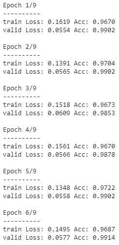

# Flower classification

PyTorch implementation of a deep learning network to identify 102 different types of flowers, developed for the [Facebook PyTorch Scholarship Challenge](https://www.udacity.com/facebook-pytorch-scholarship). After this 2-month selection process, 300 scholars were selected among 10,000, from 149 different countries, and this project is one of the reasons why I got awarded a full scholarship by Facebook AI for Udacity's 4-month Deep Learning Nanodegree.

  

## 1. Problem to solve

This project uses convolutional neural network to train an image classifier that is able to identify 102 different flower species with 99.14% validation accuracy. This image classifier can be used to identify flower species from new images, e.g., in a phone app that tells you the name of the flower your camera is looking at.

## 2. Available data

[102 Category Flower Dataset](http://www.robots.ox.ac.uk/~vgg/data/flowers/102/index.html) was given by the Nanodegree program. This dataset contains images of 102 different flower species with lables. These images have different sizes.

Data file structure:

- `flowers`: folder of image data.
    - `train`, `valid`: subfolders for training and validating the image classifier, respectively.
        - `1`, `2`, ..., `102`: 102 subfolders whose names indicate different flower categories. Given the large data size, data folders are not included here.

## 3. What I did

[Flower Classifier Notebook](flower_classifier.ipynb)
[Notebook where I tested the effects of different image transformations](test_transforms.ipynb)

1. Data loading and data preprocessing

    - Load image data
    - Training set: apply transformations such as rotation, scaling, and horizontal flipping (model generalizes / performs better)
    - All datasets: Resize and crop to the appropriate image size (required by pre-trained model)
    - All datasets: Normalize image colors (RGB) using mean and standard deviation of pre-trained model
    - Training set: data shuffled at each epoch

2. Build and train the model

    - Load a pre-trained network(several different architectures tested) and freeze parameters
    - Define a new, untrained neural network as a classifier. Assign dropout to reduce overfitting if necessary.
    - Assign criterion (NLLLoss, negative log loss) and optimizer (Adam, adaptive moment estimation). Several other combinations tested.
    - Train the classifier layers using forward and backpropagation on GPU and train all the model for a few more epochs by unfreezing all the model parameters to increase accuracy.
    - Track the loss and accuracy on the validation set to determine the best hyperparameters

3. Use the trained classifier to predict image content

    - Test trained model (99.14% accuracy on the validation set as my final submission, this accuracy was achieved using ResNet152 after several manual hyperparemeter tunning and the notebook got a little messy and I didn't save the outputs, except for [this screenshot](images/accuracy.png).
    
    
    
    - Save trained model as checkpoint
    - Write a function that gives top-5 most probable flower names based on image path
    

  

